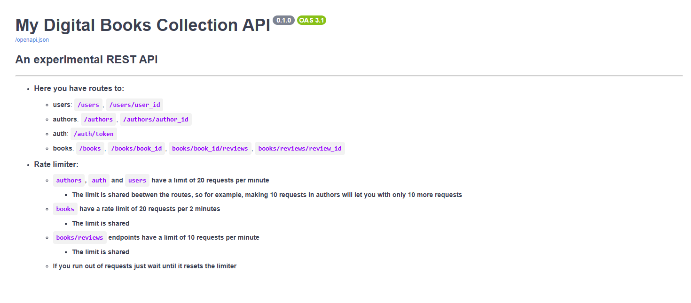
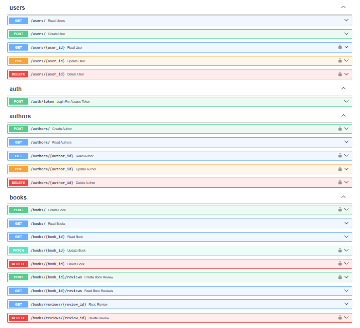

# **My Digital Books Collection**

***This REST api was built to pratice, improve, and learn new skills related to backend development.***

The "*My Digital Books Collection*" api features an almost complete web book archive. You can work together with others to build an entire relationship beetwen the books and their authors.
- All the necessary documentation about it's use can be found in the interactive documentation generated by SwaggerUI via **FastAPI**
  - Each endpoint have a brief explanation about what you can and can't do based on the HTTP method used
### The api header/title

### All endpoints

## How to run
*TODO*

## Stack

The tools below were used as the core for the API construction. You can check the other tools used for more specific tasks such as JWT generation, password hash, email sending, and test related tools at the **[pyproject.toml](https://github.com/victorrsk/mdbc-api/blob/main/pyproject.toml)**

| **Tool** | **utility** |
| :-----: | :--------: |
| **Python +3.14** | Language |
| **FastAPI** | Framework |
| **SQLite** | Database |
| **SQLModel** | Database ORM |
| **Alembic** | Database schema migrations |
| **Pydantic** | Data and schema validation |
| **Pydantic settings** | .env management |
| **Pytest** | Unit tests |

## Features
- Users CRUD ✅
- Authors CRUD ✅
- Books CRUD ✅
- Book review system ✅
- Token authentication ✅
- Query filters for books/authors ✅
- Send email message after sign up providing a valid email ✅
